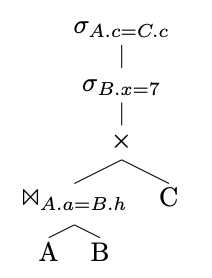

# Public repository for DBST2UE 2024

## Session 14: 12/06/2023

This session contains a set of sample exam questions/exercises. We will *not* solve all of them during the session.

### Task 1: Entity and Relationship 

Design an ER diagram for a car insurance company whose customers can own one or more cars. Each car has associated with it zero to any number of recorded accidents.

### Task 2: Relational Model and Relational Algebra

Given the following RM describing a Library:

```
User (<ins>ID</ins>, Name, Surname, Address, Email)</br>
Loan (<ins>Placement</ins>, <ins>UserID</ins>, <ins>LoanDate</ins>, ReturnDate)</br>
BookCopy (<ins>Placement</ins>, ISBN, PurchaseDate)</br>
Book (<ins>ISBN</ins>, Title, YearPub, Editor, FirstAuthor, Genre)
```

Write the following queries in RA:

1. Find the title of all the books published in the '00
2. Find the title of all the books that have not been published in the '00
3. Find the title of "Informatics" books loaned in June 2020
4. Find the name, surname, and ID of users who never took an Informatics book
5. Find the title of all the books loaned or bought in June 2020
6. Find the title of all the books that have never been loaned
7. For each user, return the title of the last book loaned
8. Find the ID of users that have loaned books of all genres

### Task 3: Functional Dependencies and Normalization

| StaffNo  | DentistName | PatientNo | PatientName | Appointment data and time | SurgeryNo |
|--------|--------|--------|--------|--------|--------|
| S1011  | Tony Smith | P100 | Gillian White | 12-Aug 10:00| S10 |
| S1011  | Tony Smith | P105| Jill Bell | 13-Aug 12:00 | S15 |
| S1024  | Helen Pearson | P108| Ian MacKay| 12-Sept 10:00 | S10 |
| S1024  | Helen Pearson | P108| Ian MacKay| 14-Sept 10:00|S10  |
| S1032  | Robin Plevin | P105 | Jill Bell | 14-Oct 16:00 |S15 |
| S1032  | Robin Plevin | P110 | John Walker | 15-Oct 18:00| S13|

#### Task 3.1
The above table is susceptible to update anomalies. Provide examples of insertion, deletion, and modification anomalies.

#### Task 3.2

Describe and illustrate the process of normalizing the Relation reported above to 3NF. State any assumptions you make about the data shown in this table.

### Task 4: SQL

Considering the exercise above, complete the following tasks:

#### Task 4.1

Write the necessary SQL commands to create the database schema.

#### Task 4.2

Write the following queries in SQL. Use nested queries and `views` when you see fit.

1. Find the title of all the books published in the '90 (90-99)
3. Show all the details of the book "Applied Informatics"
4. Find the title of Informatics books loaned in June 2020, sorted by title
6. Find the name, surname, and ID of users who never took an Informatics book
7. For each genre, find the number of times books of that genre have been loaned
8. Find the name, surname, and ID of overdue users
9. For each genre, find the number of times books of that genre have been loaned.
10. List the genres of books that have been loaned at least 20 times.
11. Find the title of all the books that have never been loaned
12. Find the genre of books with the biggest amount of loans (cumulative)
13. For each user, return the last book loaned

### Task 5. Query Optimization

#### Task 5.1
Concerning the SQL exercise above, write the canonical form of the following queries and provide an optimized version. If this is not possible or convenient, explain why. 

1. Find the title of all the books published in the '00
2. Find the title of all the books loaned or bought in June 2020
3. For each genre, find the number of times books of that genre have been loaned.
4. Find the name, surname, and ID of overdue users

#### Task 5.2

Consider the query plan depicted in the image below and optimize it. Explain each step.




### Task 6. Transactions and Deadlocks

#### Task 6.1 Isolation levels

Given the following two transactions (`T1` and `T2`) that are executed concurrently; what is the result of transaction `T2` when the isolation level is set to (refer to the Isolation Levels vs Violations chart provided below).

- `READ UNCOMMITTED`: `Eddy` | `Frank` | `NULL` | `None of the above`
- `READ COMMITTED`: `Eddy` | `Frank` | `NULL` | `None of the above`
- `REPEATABLE READ`: `Eddy` | `Frank` | `NULL` | `None of the above`
- `SERIALIZABLE`: `Eddy` | `Frank` | `NULL` | `None of the above`

> Note: Assume that the FirstName of the Employee with EmpID equals 1 is `Eddy` at the beginning.  

```
-- Transaction T1
BEGIN TRANSACTION; 
 
UPDATE EmployeeInfo
SET FirstName = 'Frank'
WHERE EmpID = 1;
 
-- Note: this blocks T1 for 5 seconds
WAITFOR DELAY '00:00:05'  
 
ROLLBACK TRANSACTION;
```

```
-- Transaction T2
BEGIN TRANSACTION; 

-- Note: this blocks T1 for 2 seconds
WAITFOR DELAY '00:00:02'  

SELECT FirstName FROM EmployeeInfo
WHERE EmpID = 1;

COMMIT;
```


#### Task 6.2 Deadlocks

Check if a deadlock is possible given the following state of requests:


```
Process A holds R and wants S
Process B holds nothing but wants T
Process C holds nothing but wants S
Process D holds U and wants S and T
Process E holds T and wants V
Process F holds W and wants S
Process G holds V and wants U
```

## Task 7. SemiStructured Data

### Task 7.1

Given the following DTD create an XML file that contains information about three articles written by two authors.

```
<!DOCTYPE NEWSPAPER [

<!ELEMENT NEWSPAPER (ARTICLE+)>
<!ELEMENT ARTICLE (HEADLINE,BYLINE,BODY)>
<!ELEMENT HEADLINE (#PCDATA)>
<!ELEMENT BYLINE (#PCDATA)>
<!ELEMENT BODY (#PCDATA)>

<!ATTLIST ARTICLE AUTHOR CDATA #REQUIRED>
<!ATTLIST ARTICLE DATE CDATA #IMPLIED>
]>
```

#### Task 7.2

Write the following XPaths/XQuery:

- (XPath) Return the names of the authors
- (XPath) Return the title of the last two published articles
- (XQuery) Produce an HTML nested unordered list `<ul>` that contains a bullet (`<li>`) for each author and contains another unordered list (`<ul>`) that contains the title and date of their articles. Both nested lists must be sorted by name of the authors and publication date of the news


## Session 13 - 12/06/24

### NoSQL - Document Database - Neo4J

#### Task 1 Setup

Start a new graph database server:

```docker run --name neo --publish=7474:7474 --publish=7687:7687 --env=NEO4J_AUTH=none -d neo4j```
 
Check that everything is running ok by visiting:

`http://localhost:7474`

Use the GUI to connect to the server and then:

#### Task 2

- Lists all available databases (`:dbs`)
- Connect to the `neo4j` database with (`:use <db>`)
- Show an overview of the database (`CALL db.schema.visualization()`) 

More info at:
[https://neo4j.com/docs/cypher-manual/4.0/](https://neo4j.com/docs/cypher-manual/4.0/)

and

[https://neo4j.com/developer/get-started/](https://neo4j.com/developer/get-started/)

#### Task 3

Connect to the running Neo4J with the browser.

Start by following the introduction steps of neo4j by working through their "Movie Graph" tutorial (`:play movie graph`). 

You can also look here for a step-by-step guide:
[https://neo4j.com/developer/cypher/guide-cypher-basics/](https://neo4j.com/developer/cypher/guide-cypher-basics/)

Make sure to execute (and verify) the CREATE-Step before trying anything else of this exercise. 

> Note: DO NOT RUN the Clean-up step before completing the exercise. Otherwise, you won't have data to work with!!

1. Show all nodes and their relationships in your database
2. Output the amount of created nodes
3. Output the amount of created relationships
4. Find all titles of movies in the database
5. Return all people who acted in the Movie with the title "Sleepless in Seattle"
6. Return all actors who acted besides "Keanu Reeves"
7. Print out the node and the number of its relationships of the node with the largest amount of relationships
8. Insert a new movie which is not already in the database, including its actors, director(s), and a producer

### Semi-Structured Data

#### Task 1 Setup

Find helpful information, tutorials, and examples of DTD, XSD, XPath and XQuery at the following link:
[https://www.w3schools.com/xml/](https://www.w3schools.com/xml/)

Verification of DTD and XSD can be done via: [https://www.xmlvalidation.com/](https://www.xmlvalidation.com/)

Verification of XPath and XQuery can be done via: 
[http://xpather.com/](http://xpather.com/) or 
[https://www.videlibri.de/cgi-bin/xidelcgi](https://www.videlibri.de/cgi-bin/xidelcgi)

#### Task 2: DTD
Create a DTD for the given XML File:

```xml
<breakfast_menu>
        <food>
               <name>Belgian Waffles</name>
               <price>$5.95</price>
               <description>Two famous Belgian Waffles with plenty of real maple syrup</description>
               <calories>650</calories>
        </food>
        <food>
               <name>Strawberry Belgian Waffles</name>
               <price>$7.95</price>
               <description>Light Belgian waffles covered with strawberries</description>
               <calories>900</calories>
        </food>
        <food>
               <name>Berry-Berry Belgian Waffles</name>
               <price>$8.95</price>
               <description>Light Belgian waffles covered with fresh berries and cream</description>
               <calories>900</calories>
        </food>
        <food>
               <name>French Toast</name>
               <price>$4.50</price>
               <description>Thick slices made from our homemade sourdough bread</description>
               <calories>600</calories>
        </food>
        <food>
               <name>Homestyle Breakfast</name>
               <price>$6.95</price>
               <description>Two eggs, bacon or sausage, toast, and hash browns</description>
               <calories>950</calories>
        </food>
</breakfast_menu>
```

#### Task 3: XPath

Based on the XML from Task 1, write the following XPaths and their results:

1. Find the 2nd food-Element of the XML
2. Find the name-Element of the last food of the XML
3. Find only the name of the last food of the XML (without tags)
4. Find all foods with calories below 900

#### Task 4: XQuery
Based on the XML from Task 1 formulate the following XQuery. Write them down as well as their results.

1. Return the name of every food above 750 calories
2. Return the name and price of each food, ordered by the price in ascending order, to fill a prepared HTML-Table (`<table></table`) with the data. (Make the result look something like this: ```<tr><td>name</td><td>price</td></tr><tr>...```)
3. Return every food if its name starts with a "B"
4. Return for all distinct values of calories as a separate HTML paragraph (`<p></p>`) including their own heading (`<h2></h2>`) and an ordered html list (`<ol></ol>`) of the names of all foods with exactly that many calories. 

    The result is supposed to look like this (actual result has to contain all 5 foods):
    
    ```HTML
    <p>
        <h2>Calories: 900</h2>
        <ol>
            <li>
                <name>Strawberry Belgian Waffles</name>
            </li>
            <li>
                <name>Berry-Berry Belgian Waffles</name>
            </li>
        </ol>
    </p>
    ```

## Log of Past Sessions

### Session 1 - 06/03/2024

We started the setup of the students' environment to get ready for the assignment and the exercises in class.

We configured PowerShell/Shell, created an SSH key (in the default location), and registered the SSH key on GitHub. 

We checked the installation of `git` and `python`. We do not enforce any specific version of Python at the moment.

We accepted the Classroom assignment for DBST2UE and added this repository as git submodule under the name `public`. We committed the changes and pushed back, checked on GitHub that the public folder is actually a link to another repository (e.g., this repository at the time we add the submodule).

We created a python virtual environment called `.venv` in the student repository (besides the `public` folder). Activated the virtual environment, updated `pip`, and installed testing dependencies including `pytest`, `pytest-cov`, and `pytest-mock`. 

Finally, we smoke-tested `pytest` by running it at the root of the probject.

The student repository at this point MUST look like this:

```
.
├── .git
├── .github
├── .gitmodules
├── .venv
├── README.md
└── public
    ├── .git
    ├── .gitignore
    └── README.md
```


### Session 2 - 13/03/2024

We finished to setup the python project, including importing the right submodule, installing pytest, pytest-cov, etc in the virtualenv `.venv`

Dr. Gambi illustrated how to configure and invoke the `pytest-cov` plugin, filter out empty files, test files, and all the files that do not belong to the project. We also included the `__init__.py` files that identify python modules.

We postponed tasks 3 to 5 to Session 3

### Session 3 - 20/03/2024

We finished to install all the dependencies, such as SQLite3 and docker. 

We experimented using docker and docker compose using MariaDB container and instructions. We experimented on how to start a plain container with environmental variables, how to connect to it using `docker exec`, and how to connect to it using port forwarding

We introduced to concept of test fixture, experimented with hardcoded and temporary files to illustrate the problem of state polluting tests.

### Session 4 - 03/04/2024

We completed the missing tasks the previous session.03 and exercised a bit on mapping a database descriptions in natural languages into ER-Models. We identify entities and relationships, discussed where to put attributes, and how to set cardinalities/participations. In one case, we also relied on Generalization (is-a) from EER.

The database model we designed implemented the backend of a simple music collection system and the description was inspired by content available at [O'Reilly Learning My SQL](https://www.oreilly.com/library/view/learning-mysql/0596008643/ch04s04.html) and [Geeks For Geeks](https://www.geeksforgeeks.org/how-to-design-a-database-for-music-streaming-app/)

### Session 5 - 10/04/2024

We reverse engineered an ER model from the pizza RM. We discussed alternative design choices at the ER-level and checked whether these could be mapped correctly back to RM-level. 

We also argued about possible simplifications considering entities with only the key attribute, weak entities, and entities connected  by 1:N relationships.

We skipped Task 2 on generating data and implementing the RM into SQLite.

We wrote two queries in Relational Algebra, a simple one, and the second that made use of set operators. We solved the queries by splitting complex queries into simpler ones.

### Session 6 - 18/04/2024

Self-Learning - Part 1

### Session 7 - 23/04/2024

Self-Learning - Part 2

### Session 8 - 24/04/2024

We exercise some more with RA on the pizza database and we started working with SQL to create tables and define constraints (SQL as DDL). Additionally, we also started to insert data/values in the database (SQL as DML).

### Session 9 - 08/05/2024

We exercise more on complex SQL queries that requires the use of set operators, nested queries and subqueries. We used the Pizza db as test subject. We discussed conceptual approaches to generate test cases to validate our queries.
We experimented creating and modifying views.
We discussed the implications of different configurations of the referential constraint triggers (ON DELETE|ON UPDATE).

### Session 10 - 06/03/2024

We exercise on translating SQL queries CANONICAL query trees, estimating their cost, and optimizing them by restructuring the query trees.

We had an hands on experience on:

- installing packages into a linux docker container
- connecting to a mariadb database running inside docker
- installing/creating a mariadb from a database dump stored in a `.sql` file
- Creating index on non-key attributes, observing the performance speedup, and using EXPLAIN/ANALYZE to gather more info on the query

### Session 11 - 22/05/24

We exercised on functional dependencies and normalization by transforming a poorly designed relation into a set of interconnected ones, such that each relation is in 3NF.

We also did exercises on scheduling of transactions proving/disproving serializable schedules.

### Session 12 - 05/06/24

We solved exercises on finding/causing deadlocks with exclusive and shared locks. We experimented simulating the execution of concurrent transactions to create resource-graphs and wait-for graph, then finding deadlocks/cycles in those graphs.